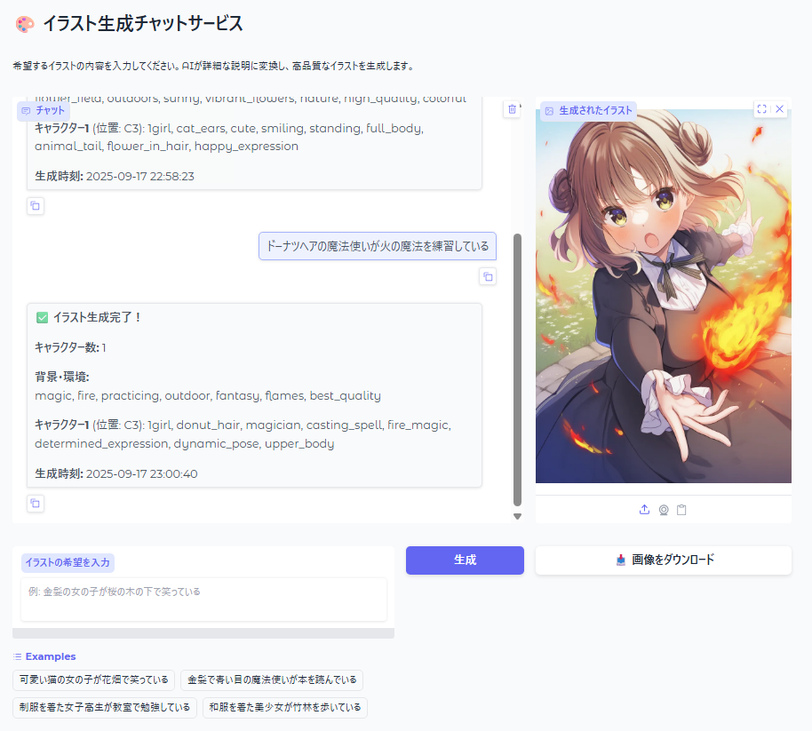

# 🎨 NAIPGRA (ないぴぐら) - チャット形式イラスト生成

GradioのWebUIでユーザーが希望するイラストを生成するチャットサービスです。

## 📋 概要

このプロジェクトは、ユーザーの自然な日本語入力を高品質なイラストに変換するWebアプリケーションです。



### 🔄 生成フロー

1. **ユーザー入力** → ユーザーが希望するイラストの詳細をチャットで入力
2. **GPT-4o処理** → LangChainのGPT-4oで構造化プロンプト（JSON形式）に変換・補完
3. **NovelAI v4.5生成** → キャラクター座標対応で高品質画像生成（832x1216解像度）
4. **結果表示** → Gradioチャットに画像とダウンロードボタンを表示

## ✨ 特徴

- 🤖 **GPT-4o活用**: 自然な日本語から構造化プロンプト（JSON）への高精度変換
- 🎯 **キャラクター座標対応**: 1-6キャラクター、A1-E5座標指定可能
- 🎨 **NovelAI v4.5 Curated**: 最新モデルによる高品質アニメ風イラスト生成
- 🔧 **拡張プロンプト機能**: 環境変数でメイン・キャラクタープロンプトに共通要素を自動追加
- 🌐 **美しいWebUI**: 中央揃え・レスポンシブ対応のGradioインターフェース
- 📥 **ダウンロード機能**: 生成画像の簡単ダウンロード
- 📱 **リアルタイム**: 処理状況をリアルタイムで表示
- 🔧 **エラーハンドリング**: ポート競合時の自動ポート検索

## 🚀 セットアップ

### 1. 依存関係のインストール

```bash
pip install -r requirements.txt
```

### 2. 環境変数の設定

`.env`ファイルを作成し、以下の設定を追加：

```env
# OpenAI API設定
OPENAI_API_KEY=your_openai_api_key_here

# NovelAI API設定
NOVELAI_USERNAME=your_novelai_username_here
NOVELAI_PASSWORD=your_novelai_password_here

# 拡張プロンプト設定（オプション）
# メインプロンプトに常に追加される内容
NOVELAI_EXTEND_PROMPT=ultra_detailed, extremely_detailed, photorealistic

# キャラクタープロンプトに常に追加される内容
NOVELAI_EXTEND_CHARACTER_PROMPT=perfect_face, detailed_eyes, high_quality_skin

# Gradio設定（オプション）
GRADIO_PORT=7860
GRADIO_HOST=127.0.0.1
```

### 3. アプリケーションの起動

```bash
python main.py
```

ブラウザで `http://127.0.0.1:7860` にアクセスしてください。

## 📁 ファイル構成

```
NAIPGRA/
├── main.py            # メインアプリケーション（Gradio WebUI）
├── chatGPT.py         # GPT-4oによる構造化プロンプト変換
├── novelai.py         # NovelAI v4.5 API画像生成（キャラクター座標対応）
├── requirements.txt   # 依存パッケージ
├── .env               # 環境変数（作成が必要）
├── .gitignore         # Git除外設定
└── README.md          # このファイル
```

## 🛠️ 技術スタック

- **フロントエンド**: Gradio WebUI
- **AI処理**: 
  - OpenAI GPT-4o (LangChain経由)
  - NovelAI v4.5 Curated (novelai-api経由)
- **画像処理**: PIL (Pillow)
- **並行処理**: asyncio, aiohttp
- **環境管理**: python-dotenv

## 💡 使用例

### 📝 基本入力例
```
猫の女の子が花畑で笑っている
```

### 🤖 GPT-4o構造化出力例
```json
{
  "characterCount": 1,
  "prompt": "flower_field, outdoor, flowers, nature, sunny, best_quality, masterpiece",
  "characterPrompts": [
    {
      "prompt": "1girl, catgirl, cute, smiling, floral_background, standing, full_body, animal_ears, tail",
      "position": "C3"
    }
  ]
}
```

### 🔧 拡張プロンプト適用例
**環境変数設定**:
```env
NOVELAI_EXTEND_PROMPT=masterpiece, best_quality, ultra_detailed
NOVELAI_EXTEND_CHARACTER_PROMPT=perfect_face, detailed_eyes
```

**最終生成プロンプト**:
```
メインプロンプト: "masterpiece, best_quality, ultra_detailed, flower_field, outdoor, flowers, nature, sunny"
キャラクター: "perfect_face, detailed_eyes, 1girl, catgirl, cute, smiling, animal_ears, tail"
```

### 🎨 複数キャラクター例
```
入力: ぐらちゃんとるしあちゃんが一緒にいる
```
```json
{
  "characterCount": 2,
  "prompt": "2girls, indoors, virtual_youtuber, hololive, best_quality, masterpiece",
  "characterPrompts": [
    {
      "prompt": "gawr_gura, shark_tail, hoodie, blue_eyes, smiling, full_body",
      "position": "B2"
    },
    {
      "prompt": "uruha_rushia, green_hair, twintails, red_eyes, gothic_lolita, full_body, looking_at_viewer",
      "position": "D2"
    }
  ]
}
```

### 📱 出力結果
- **解像度**: 832x1216の高品質アニメ風イラスト
- **キャラクター配置**: A1-E5座標グリッドに正確配置
- **品質向上**: 拡張プロンプトにより一貫した高品質
- **ダウンロード**: 生成完了と同時にダウンロードボタン表示

## ⚙️ 設定

### NovelAI設定
- **モデル**: NovelAI v4.5c (Anime_v45_Curated)
- **解像度**: 832x1216（縦長・スマホ壁紙に最適）
- **品質**: 高品質設定（steps=28, scale=5.0）
- **キャラクター座標**: A1-E5グリッド対応（A1=左上、E5=右下、C3=中央）
- **同時生成**: 最大6キャラクター対応

### 拡張プロンプト機能
- **NOVELAI_EXTEND_PROMPT**: 全画像のメインプロンプトの先頭に自動追加
  - 例: `masterpiece, best_quality, ultra_detailed`
  - 効果: 品質タグが最優先で適用される
- **NOVELAI_EXTEND_CHARACTER_PROMPT**: 全キャラクタープロンプトの先頭に自動追加
  - 例: `perfect_face, detailed_eyes, beautiful`
  - 効果: キャラクターの顔・表情品質が向上
- **配置**: 先頭配置により最高優先度で画像生成に影響
- **使用例**: 一貫した品質やスタイルを全生成画像に適用

## 🔧 トラブルシューティング

### よくある問題

1. **APIキーエラー**
   - `.env`ファイルの設定を確認
   - OpenAI/NovelAIアカウントの有効性を確認

2. **ポート競合**
   - 自動的に利用可能ポートを検索（7860→7861→7862...）
   - 手動設定: `.env`で`GRADIO_PORT`を変更

3. **LangChain警告**
   - `BaseChatModel.__call__`の非推奨警告は動作に影響なし
   - 将来のアップデートで修正予定

4. **画像生成失敗**
   - NovelAIアカウントクレジット残高を確認
   - ネットワーク接続を確認

5. **拡張プロンプトが適用されない**
   - `.env`ファイルで`NOVELAI_EXTEND_PROMPT`と`NOVELAI_EXTEND_CHARACTER_PROMPT`を確認
   - アプリケーション再起動で環境変数を再読込
   - ログで「拡張プロンプト追加（先頭）」メッセージを確認

## 📝 ライセンス

このプロジェクトは個人・学習目的での使用を想定しています。

## 🙏 謝辞

- [NovelAI](https://novelai.net/) - 高品質画像生成API
- [OpenAI](https://openai.com/) - GPT-4o言語モデル  
- [Gradio](https://gradio.app/) - WebUIフレームワーク
- [LangChain](https://langchain.com/) - AI統合フレームワーク

---

**注意**: このツールはAPIクレジットを消費します。使用前に各サービスの料金体系をご確認ください。
